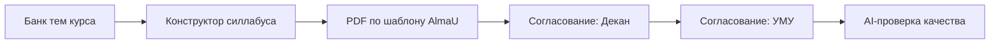

# AlmaU Syllabus Builder

Система, где преподаватель один раз создает банк тем по предмету, а каждый семестр
собирает силлабус из готовых блоков, согласовывает и получает PDF.

Документация для диплома: `docs/diploma_report.md`.

## Проблема
- Силлабусы живут в разрозненных Word-файлах и копиях.
- Каждый семестр - ручной копипаст тем, недель, часов, литературы.
- Нет единого хранилища, истории изменений и прозрачного workflow.

## Решение
Онлайн-конструктор силлабуса, где ядро - банк тем и материалов курса. Силлабусы
создаются на семестр из готовых блоков, проходят согласование и сохраняются в системе.

## Ключевые функции
- Банк тем на уровне курса (многоязычные названия/описания, литература, вопросы).
- Конструктор силлабуса на семестр (выбор тем, порядок, часы, недели).
- Генерация PDF по шаблону AlmaU.
- Общие курсы между преподавателями (fork курса).
- Workflow согласования: черновик -> декан -> УМУ.
- AI-проверка готового силлабуса (не генерация, а анализ качества и структуры).
- AI-перевод фрагментов на три языка (через помощник).

## Роли и доступы
- Преподаватель: создает курсы/темы, собирает силлабус, отправляет на согласование.
- Декан: утверждает/отклоняет после отправки преподавателя.
- УМУ: финально утверждает после декана.
- Админ: доступ к любой сущности.

## Типовой сценарий
1) Преподаватель создает курс и заполняет банк тем.
2) На новый семестр собирает силлабус из отмеченных тем.
3) Система рассчитывает недели и формирует PDF.
4) Силлабус уходит на согласование и фиксируется в журнале.
5) По готовому силлабусу запускается AI-проверка качества.

Подробный гайд по работе в системе: `docs/usage.md`.

## Архитектура и приложения
- `accounts`: пользователи и роли.
- `catalog`: курсы, темы, литература, вопросы.
- `syllabi`: силлабусы по семестрам, связи с темами, PDF.
- `workflow`: статусы согласования и лог.
- `ai_checker`: проверка качества на базе Hugging Face.

## Схема процесса (Mermaid)


## Установка и запуск
1) Создать виртуальное окружение и установить зависимости:
```bash
python -m venv venv
venv\Scripts\activate
pip install -r requirements.txt
```
2) Настроить БД в `config/settings.py`.
3) Применить миграции:
```bash
python manage.py migrate
```
4) Запустить сервер:
```bash
python manage.py runserver
```

## PDF и зависимости
Генерация PDF использует WeasyPrint. Для работы нужны системные зависимости
(GTK/Pango). Если их нет - вернется 501 с подсказкой по установке.

## AI-проверка
Модуль AI-проверки строит текст силлабуса, делает краткое резюме и дополняет
его структурным анализом (покрытие недель, отсутствие литературы/вопросов).

## Шаблон для диплома (кратко)
1) Актуальность: силлабус хранится в Word, много копирования и ошибок.
2) Цель: создать онлайн-систему конструктора с банком тем и централизованным workflow.
3) Задачи: модель данных, конструктор, PDF, роли/согласование, AI-анализ.
4) Результат: повторное использование контента и прозрачное согласование.

## Дальнейшие улучшения
- Более гибкая сетка недель и контроль нагрузки.
- Пакетная загрузка/импорт тем из Excel.
- Полноценные шаблоны AlmaU и мультиязычные PDF.
